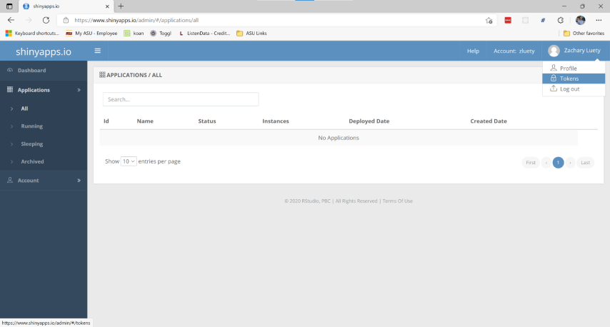
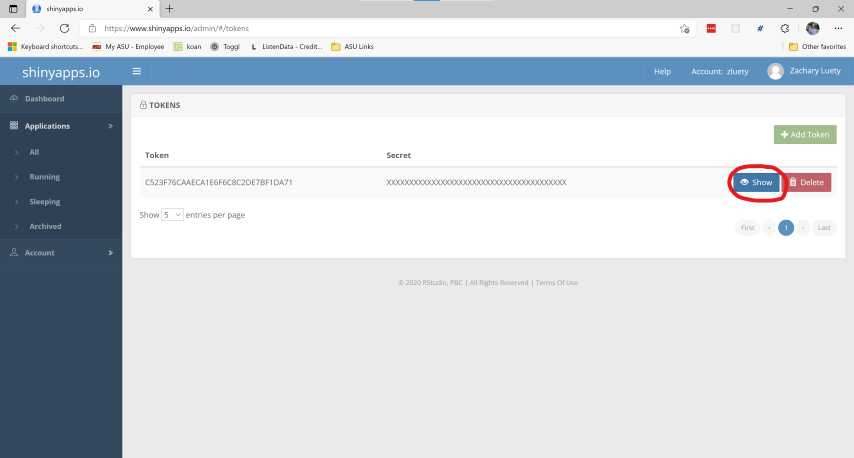

https://pauleunkim.shinyapps.io/myApp/

# Polyglot

A _polyglot_ is someone capable of speaking several languages 🗣. Being a polyglot data scientist allows you to leverage the best features and libraries each programming language has to offer. In this project you will flex 💪 the R and Python skills you've built throughout this course to build an interactive Shiny application.

## Project Brief

### Part 1: Web Scraping 🌐

For part 1 of this project you must use Python to scrape data from the web and produce a CSV file as output. Write your web scraping code inside the `Python/webscrape.py` or `Python/webscrape.ipynb` file. The CSV output **must be saved to the `R/App/data` folder** (or at least copied to that folder prior to proceeding to Parts 2 and 3).

### Part 2: Shiny App 👩‍💻

For part 2 of this project, you must create a Shiny app. The app must utilize the CSV data created by your Python web scraping script (or notebook). Your app should include at least two different kinds of GUI components/widgets (slider, checkbox, table, tabs, menubar, radio button, submit button, etc.). Your app must also include an **interactive** plot. Feel free to like at some examples from Shiny's [Gallery](https://shiny.rstudio.com/gallery/) for inspiration.

I have included some sample code so you can test running and deploying (details below) your Shiny application right away. Edit these files however you like (including removing all together), but keep all your Shiny application code inside the `R/App` folder.

### Part 3: Deploying to shinyapps.io 📦

In addition to pushing all your code to GitHub, you must upload your Shiny app to [shinyapps.io](https://www.shinyapps.io/).

#### Instructions for uploading to shinyapps.io

1. Install the `rsconnect` package from R Studio

```r
install.packages("rsconnect")
# Wait for installation to complete
library(rsconnect)
```

2. Go to [shinyapps.io](https://www.shinyapps.io/) and create an account. Select the free account which allows you to deploy up to 5 applications or a combined total run time of 25 hours per month for free.

3. Once you have created your account, you need to configure `rsconnect` to use that account. From your shinyapps.io Dashboard click on your User avatar in the top right and select "Tokens". From the tokens menu click on the blue "Show" button. From the popup window select "Copy to clipboard". Paste you results into the R console in the RStudio IDE and hit Enter.





4. Once `rsconnect` has been configured, you can deploy your application using the `deployApp` function. Once the deployment finishes, your browser should open automatically to your newly deployed application. Congratulations, you have deployed your first application 🥳!

_NOTE: Only contents within the `R/App` folder or within a subdirectory of the `R/App` folder will be included in your deployment to shinyapps.io. Additionally, all paths must be given relative to the app directory (e.g. data/mydata.csv, rather than C:/Users/Username/project/R/App/data/mydata.csv)._

```r
rsconnect::deployApp('App/')
```

5. You can continue to make changes to your app code and run `deployApp` again. `rsconnect` can deploy an app much more quickly after the first deployment.

**ONCE YOU HAVE DEPLOYED YOUR APPLICATION, COPY YOUR APP URL INTO THE `R/APP_INFO.txt` FILE**

### Part 4: Video 🎥

Create a brief (<5 min) video presentation. Your presentation should show website you collected your data from and demonstrate what your Shiny app does. Upload your video to Canvas ([upload instructions](https://community.canvaslms.com/t5/Student-Guide/How-do-I-submit-a-media-file-as-an-assignment-submission/ta-p/279)).

## Grading

Points for your project will be:

- Part 1: Web Scraping (25 pts)
- Part 2: Shiny App (35 pts)
- Part 3: Deploying to shinyapps.io (10 pts)
- Video presentation (20 pts)
- Reproducibility and organization (10 pts)

Style and format does count for this assignment, so please take the time to make sure everything looks good and your data and code are neat and easy to read.

### Tips

Review the marking guidelines and ask questions if any of the expectations are unclear.

When you’re done, review the documents on GitHub to make sure you’re happy with the final state of your work. Then go get some rest! 😴
